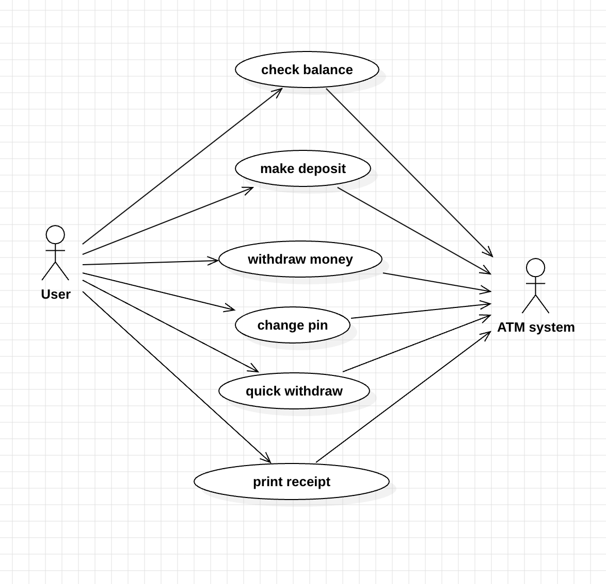
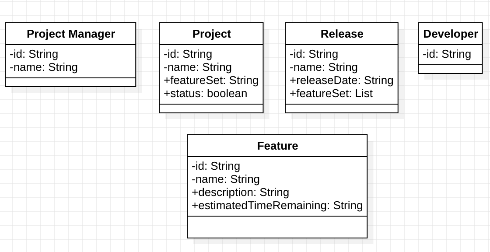
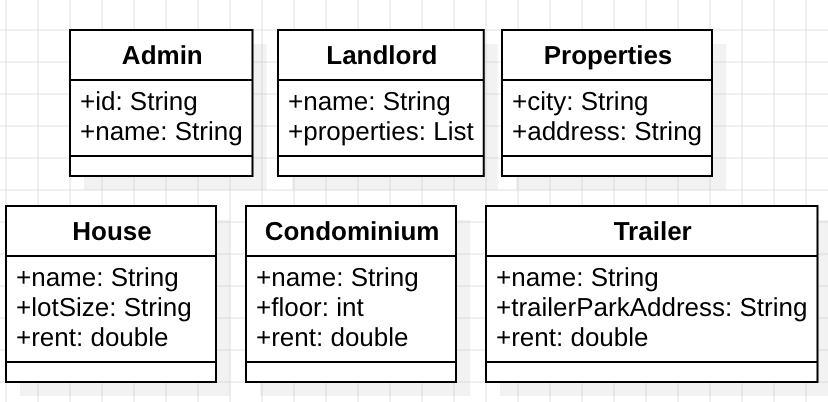

Lab 1

1. Use Case Description for WITHDRAW_MONEY:

    | User Action | System Response |
    |--|--|
    | 1.User types in PIN into main screen | 1.System checks validity of PIN and presents options to user on another screen |
    | 2.User selects “Withdraw Money” | 2.System displays the screen asking user to enter the desired amount that they want to withdraw |
    | 3.User enters the desired amount and press “Enter” | 3.System checks the amount entered and withdraws the money. |

1.C. User Story:

    1. As an ATM user, I want to enter PIN so that I can see the main screen.
    2. As an ATM user, I want to enter my desired amount so that I can withdraw the amount of money that I want.

2. Use Case Diagram:

    

3. Project Management Tracking System

    List of Noun Phrases(SRS):
        - developer
        - feature
        - feature set
        - Project Manager
        - Project
        - piece of project
        - final release
        - release
        - release date

    

4. Properties Management System

    List of Noun Phrases(SRS):
        - address
        - admin module
        - city
        - condominium
        - floors
        - house
        - landlord
        - lot size
        - properties
        - rent
        - types of properties
        - trailer
        - trailer park

    